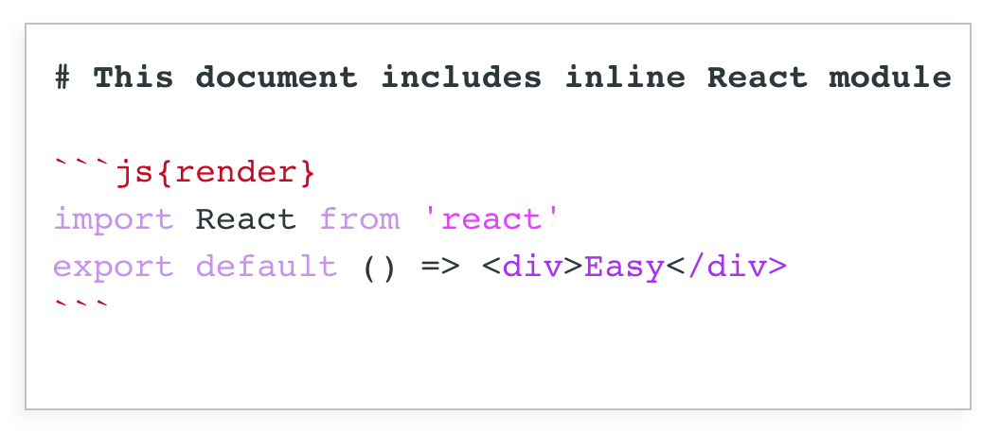

render-react-markdown-loader
==

The [Webpack](https://webpack.js.org) loader to transform markdown document into the React component.

It extends the standart markdown syntax with few features. Mainly, the ability to render React modules, that described directly in the markdown code blocks.



The modified syntax does not conflict with the standart markdown specification, so you takes superpowers safely.

Visit the playground:
[https://morulus.github.io/render-react-markdown-loader](https://morulus.github.io/render-react-markdown-loader)

Install
--

Using [Yarn](https://yarnpkg.com/lang/en/):
```shell
yarn add render-react-markdown-loader --dev
```

Do You guess yourself how to do this using [_npm_](https://docs.npmjs.com/cli/npm), if needed?

### Peer dependencies

Package requires React 16+, but you determine its exact version. So you should install [react@16.*](https://www.npmjs.com/package/react) in your project.

> Wanna play with React 15? You can try, but without guarantees.

### Webpack configuration

Add `render-react-markdown-loader` to the rule matched `.md` in your [webpack configuration](https://webpack.js.org/configuration/).

```js
rules: [
  {
    test: /\.md$/,
    exclude: /node_modules/,
    use: 'render-react-markdown-loader'
  }
]
```

Import markdown as React component
--

After modifying [Webpack configuration](#webpack-configuration) you may import your markdown document as usual React component.


```js
import AwesomeArticle from './awesome-article.md'

export default () => (
  <div>
    <h2>And here is my favour article</h2>
    <AwesomeArticle />
  </div>
)
```
You do not need to perform any additional actions to start usign it.

Next syntax
--

To fire javascript and React inside a markdown document you'll need to create classic markdown code block with one of the following flags inside curly brackets after specifying a language:

**\```js{eval}**

A javascript code, described inside the code block with the flag `{eval}` will be executed on the top of the document. And variables, defined while executing, (including import statement) will be available for each next code block

**\```js{render}**

The code from code block with flag `{render}` will be perceived as a module, which exports React component. That component will be rendered instead of code block.

**\```js{render+}**

The code block with flag `{render+}` works the same as `{render}`, but original code, described in the block, will be keeped and displayed in the tag `<code>` after rendered module.

This approach is very useful when you'd wish to demonstrate some component and simultaneously display it's source code.

**\```jsx{render}**

If you specify language name `jsx` then logic of renderer coming different. The contained code will be perceived as JSX tags and will be rendered as an anonymous React component.

> The only way to use in that kind of code blocks something else instead basic HTML tags is previously defining global variables in the code block `{eval}`.

## Props

Your component, crafted from the markdown document, can accept the props.

```jsx
<AwesomeArticle
  color="cyan"
/>
```

And, of course, your inline modules, described in code blocks, can take it.

```js
import React from 'react'

export default ({ color }) => (
  <div>Today my favour color is {color}</div>
)
```

This way you can affect the state of the inline modules in runtime.

### Import images

When you use markdown image syntax, you'd like to add images, described in it, in to the application bundle.

To do that, set option `importImages` to `true`. Enabling this option will extract all `` images from your markdown document into the separated import statements.

Of course, `render-react-markdown-loader` does not have loader for the images, it only create import statements for them. Thus, you should care by yourself about appropriate loader for the images. Like this:

```js
{
  test: /\.md$/,
  exclude: /node_modules/,
  use: {
    loader : 'render-react-markdown-loader',
    options: {
      importImages: true,
    },
  }
},
{
  test: /\.(png|jpg)$/,
  exclude: /node_modules/,
  use: 'file-loader'
}
```

## React markdown configuration

There is [React markdown](https://github.com/rexxars/react-markdown) under the hood. You'd like to specify options for it. You can do it by specifying property `config` in the webpack loader options.

You should specify the absolute path to javascript file, which contains React markdown configuration (for example, `react-markdown.config.js`), to make configuration survive while stringifying.

```js
{
  test: /\.md$/,
  exclude: /node_modules/,
  use: {
    loader: 'render-react-markdown-loader',
    options: {
      config  : require.resolve(`./react-markdown.config.js`),
    },
  }
}
```

And here is sample of `react-markdown.config.js`:

```js
module.exports = {
  renderers: {}
}
```

With a custom React markdown configuration, you may, for example, specify components for any standart tag, rendered in the document.

```js
module.exports = {
  renderers: {
    heading: function() {
      return createElement(`h${props.level}`, null, props.children)
    }
  }
}
```

See [React markdown's documentation](https://github.com/rexxars/react-markdown#options) to get more.

### Render HOC

Specify the render HOC, that accepts final component, and returns new component, which contain your custom logic.

For example, you can use it to pass props to the component.

```js
import { withProps } from 'recompose';

module.exports = {
  renderers: {
    render: withProps({
      version: 'v0.3.1'
    })
  }
}
```

### Chunk renderer

Specify *chunk* renderer, that will be used as wrapper for each inline module.

```js
{
  renderers: {
    chunk: (children) => {
      return <div className={styles.MyChunkStyle}>
        {children}
      </div>
    }
  }
}
```

### Babel and other languages


By the default the loader supports only `js` and `jsx` languages and has appropriated transpiler [babel](https://babeljs.io/) with preset [es2015](https://babeljs.io/docs/en/learn) and plugin [babel-plugin-transform-react-jsx](https://www.npmjs.com/package/babel-plugin-transform-react-jsx), which transplies code to es5.

But you can change that behavior and make support for any language you'd wish. To do that, specify option `languages` in the loader configuration.

No matter what language you'd wish, all you need is to get appropriate transplier for it, which can transform specific syntax of your language into the es5 javascript syntax.

For example, if that language is [Coffee Script](https://coffeescript.org/), then the `languages` option will look like this:

```js
const CoffeeScript = require('coffeescript')

const rrmOptions = {
  loader :  'render-react-markdown-loader',
  options: {
    languages: {
      coffee: code => ({
        code: CoffeeScript.compile(code)
      })
    }
  }
}
```

Also, if you prefer to use your own babel configuration for es6, you may specify custom transpiler for `js` language.

```js
const rrmOptions = {
  loader :  'render-react-markdown-loader',
  options: {
    languages: {
      js: (code) => babel.transform(code, {
        babelrc: true
      })
    }
  }
}
```

But make sure that your transplaner make the es5 code.

### AST walker and metadata

Specify an `walkAst` configuration property, to walk source AST, before loader will do.

`walkAst` accepts `ast` and `meta`. The `meta` is an object that will be placed as a static property of the exports.

The following example extracts document title and add em to the meta:
```js
{
  test: /\.md$/,
  exclude: /node_modules/,
  use: {
    loader: 'render-react-markdown-loader',
    options: {
      walkAst: (ast, meta) => {
        // Search for heading
        const headingKey = ast.children.findIndex(item => {
          if (item.type === `heading` && item.depth === 1) {
            return true;
          }
        });

        if (headingKey >= 0) {
          // Place heading to the meta
          meta.heading = ast.children[headingKey].children[0]
            && ast.children[headingKey].children[0].value;
          ast.children.splice(headingKey, 1)
        } else {
          // Place default heading
          meta.heading = false;
        }

        return ast;
      }
    }
  }
}
```

After that you can find collected metadata in the static property `meta` of the component.

```js
import AwesomeArticle from 'awesome-article.md'

export default() {
  return (
    <div>
      <h1>{AwesomeArticle.meta.heading}</h1>
      <content>
        <AwesomeArticle />
      </content>
    </div>
  )
}
```

### AST renderer

As super-advanced customization level you able to specify how exactly AST will be transformed into the javascript. Also you can add some initial code to the `evalChunks`.

```js
{
  test: /\.md$/,
  exclude: /node_modules/,
  use: {
    loader: 'render-react-markdown-loader',
    options: {
      renderer: function(ast, evalChunks, defaultRenderer, meta) {
        evalChunks.push(`const lodash = require('lodash');`)

        return defaultRenderer(ast);
      },
    }
  }
}
```

The function `defaultRenderer`, received as 3th argument, render AST with the native logic. You may discard it and  convert AST to javascript code in your way. Of course, this is a very hard level of customization and promises possible problems that you will have to solve yourself.

### Contributing

The component code contains a lot of clutter, from a certain point it was developed in the way of BugDD. All this due to lack of time. Help is always welcome.

License
--

MIT, 2017-2019 Vladimir Kalmykov <vladimirmorulus@gmail.com>
